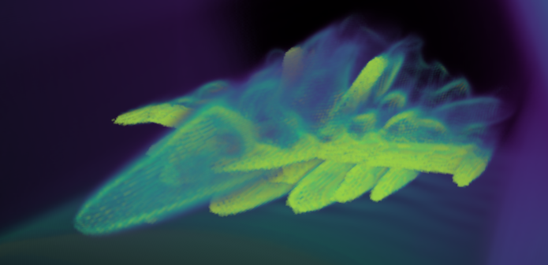
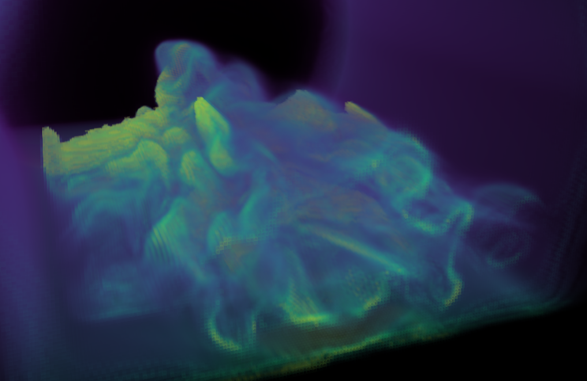
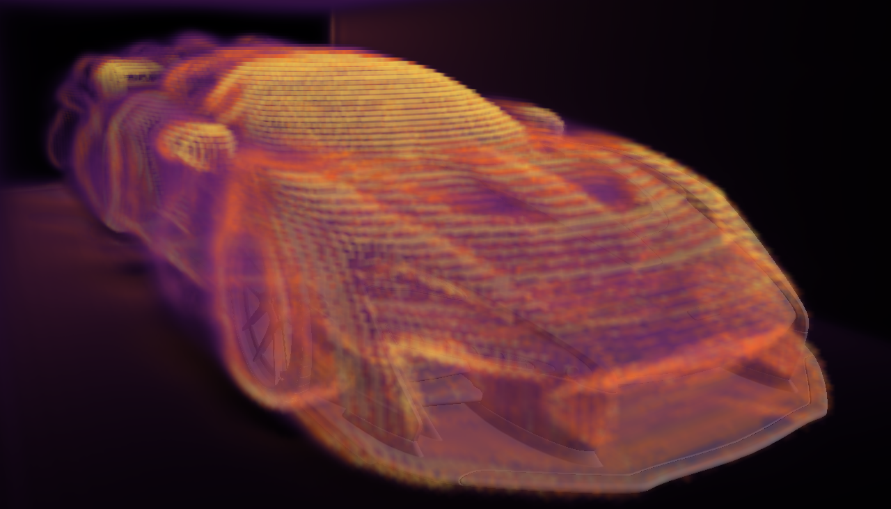
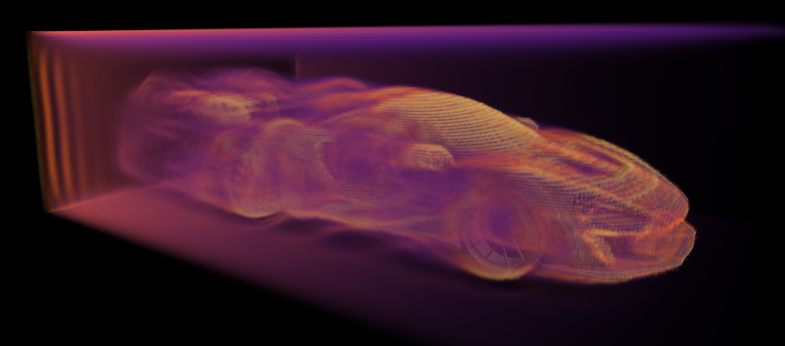
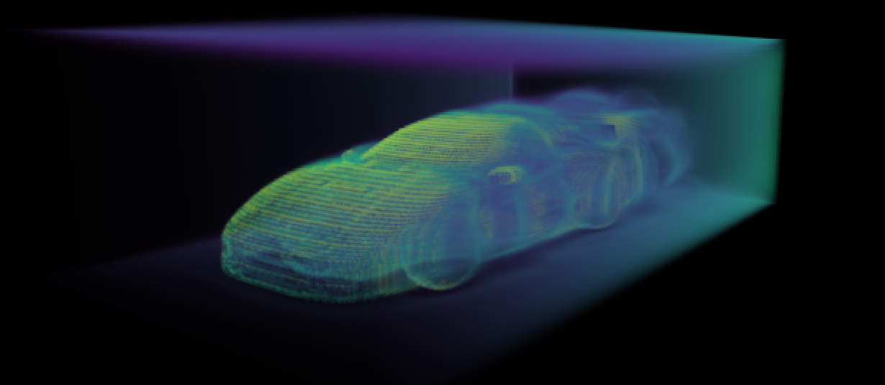
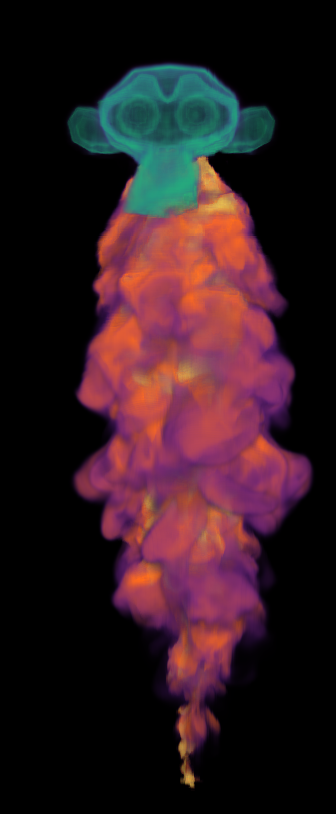
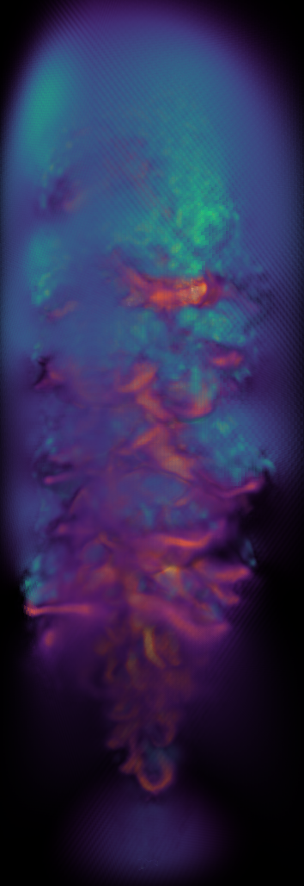
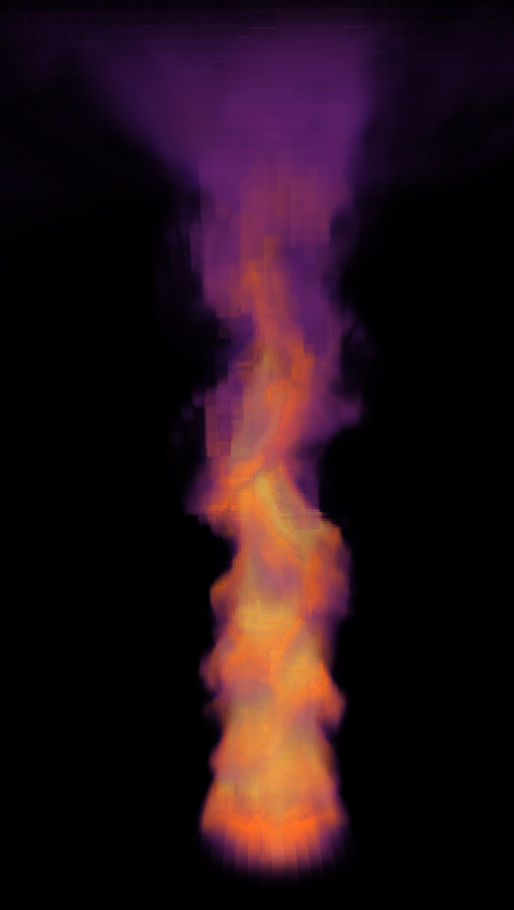
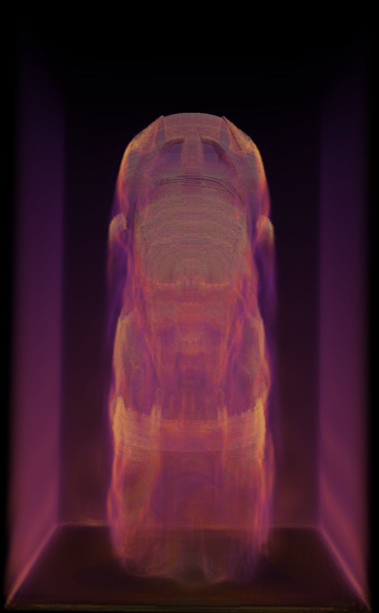

https://github.com/user-attachments/assets/400a1dad-69ee-4da0-b8cb-64ec80a6a7c5

https://github.com/user-attachments/assets/3ca25560-3ca2-4531-af0b-d6cfe14328d3

  
  
  
  

https://github.com/user-attachments/assets/afd72bfb-1bcb-4e7c-b6c4-bfca075efc2c

